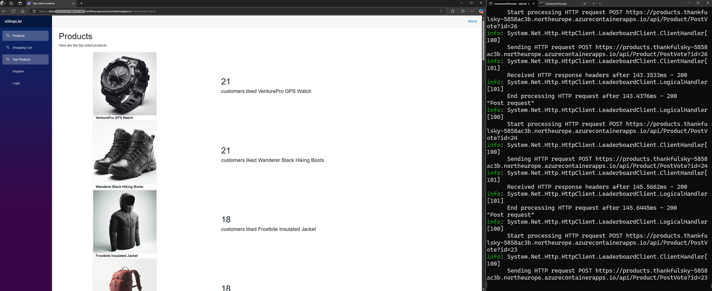
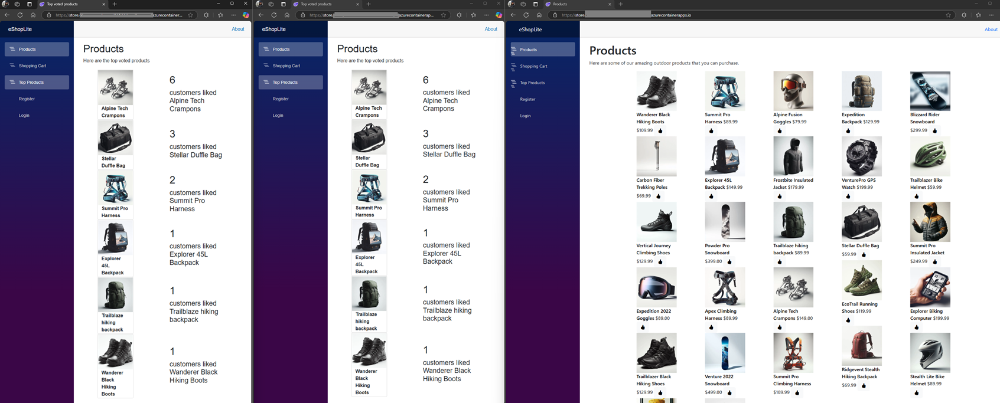
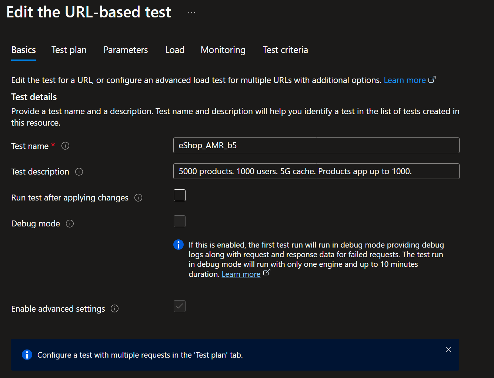
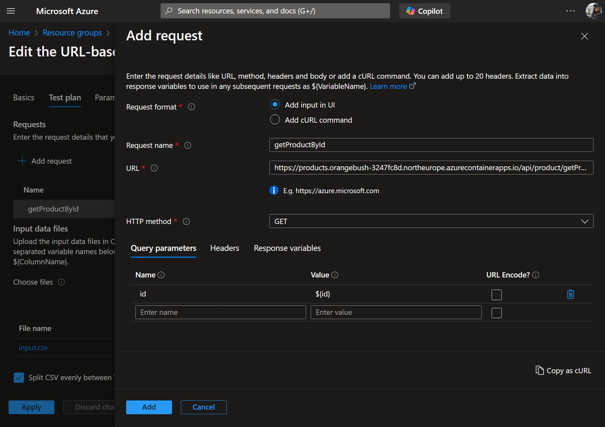
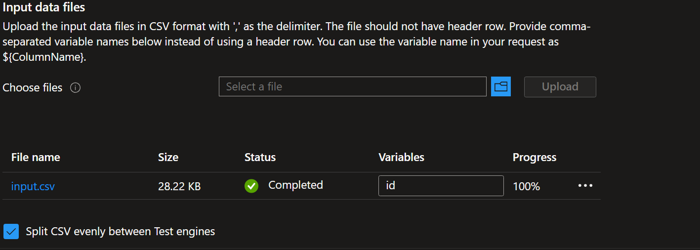
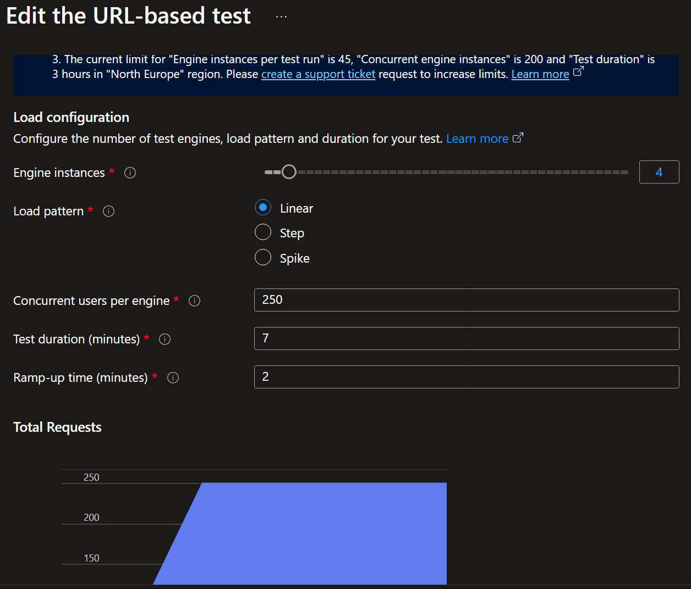
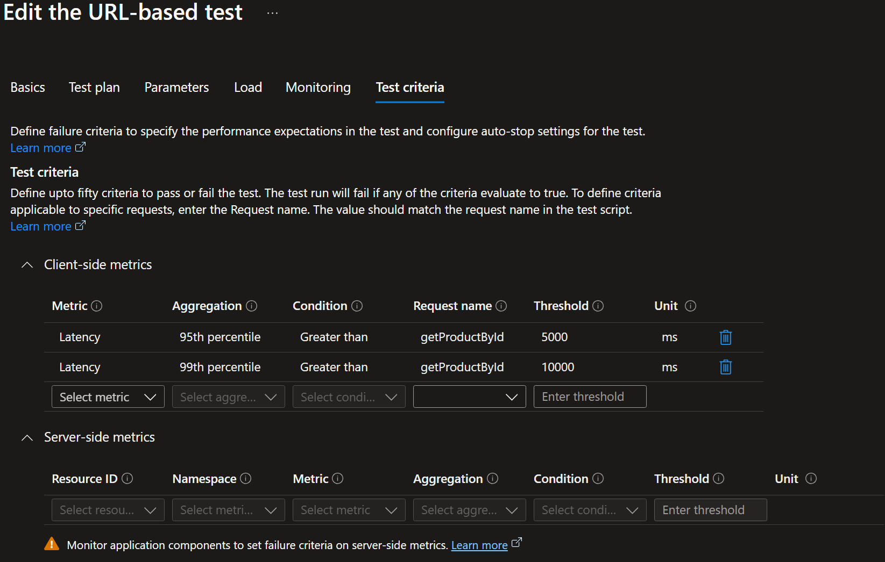
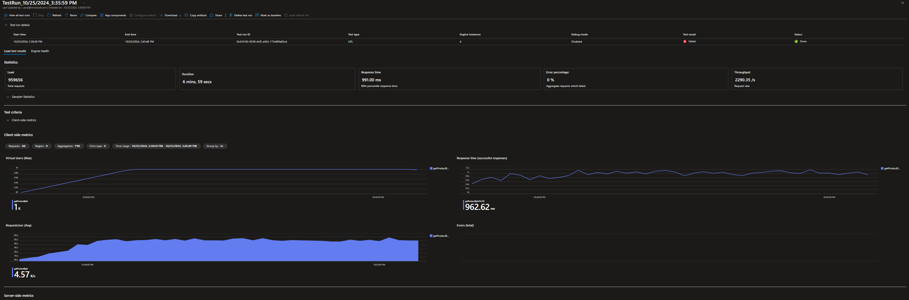
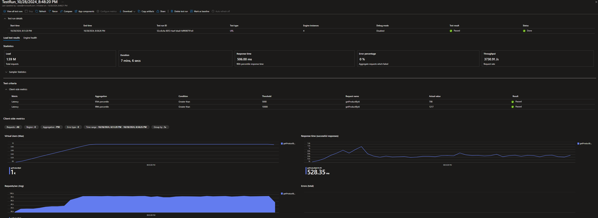
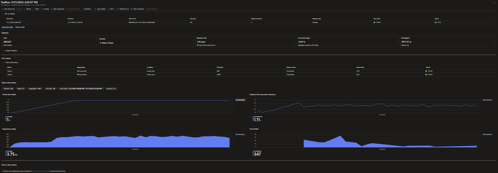

# Improving .NET Aspire eShop web application using Azure Redis Services

This code repository is based on the [.NET eShop](https://github.com/dotnet/eShop) and [eShopLite](https://github.com/MicrosoftDocs/mslearn-dotnet-cloudnative-devops) projects.
The application code was refactored to highlight the usage of Azure Redis, and for the convenience of running performance testing.
Thanks to the colleagues who worked on the two reference projects!

## Pre-requisites
- [Visual Studio 2022](https://visualstudio.microsoft.com/vs/)
- [Visual Studio 2022 Preview](https://visualstudio.microsoft.com/vs/preview/)
- [.NET 8](https://dotnet.microsoft.com/en-us/download/dotnet/8.0)
- [.NET 9 preview](https://dotnet.microsoft.com/en-us/download/dotnet/9.0)
- [Docker Desktop](https://www.docker.com/products/docker-desktop/)
- Register for Azure Managed Redis private preview access: 
    ```
    az login
    az account set --subscription <subscription id>
    az feature register --namespace "Microsoft.Cache" -n "may2024preview"
    ```
    check registration status with:
    ```
    az feature show --namespace "Microsoft.Cache" -n "may2024preview"
    ```
    

## Running the project in Azure using Azure Managed Redis (Preview) B1 
The B1 SKU is designed for quick dev/test scenario in Azure.

1. Download this repository
    ```
    git clone https://github.com/CawaMS/Aspire_eShop_redis-WIP.git
    ```
2. Change directory to the AppHost folder

    ```
    cd ./Aspire_eShop_redis-WIP/eShopLite.AppHost
    ```

3. Use Azure Developer CLI tp deploy to Azure
    ```
    azd up
    ```

4. Recommending to use 'East US'. All region, control plane, and performance optimziations roll out will finish on Thursday Nov 14. 

## Running the project in Azure using other Azure Redis service SKUs

To clone a branch use:
```
git clone -b <branch> https://github.com/CawaMS/Aspire_eShop_redis-WIP.git
```
The follow branches contains the customized bicep files generated from `azd infra synth` command.
The `infra` folder can be found in the `eShopLite.AppHost` folder
- OSS Basic C3 (~5G, $131.4/mon) with Entra ID: [azd_BasicC3_EntraID](https://github.com/CawaMS/Aspire_eShop_redis-WIP/tree/azd_BasicC3_EntraID)
- OSS Basic C3 (~5G, $131.4/mon)  with automatically populated connection strings in key vault: [azd_BasicC3_ConnectionString](https://github.com/CawaMS/Aspire_eShop_redis-WIP/tree/azd_BasicC3_ConnectionString)
- Azure Managed Redis (Preview) B5 (~5G, $227.76/mon) with High Availability using automatically populated connection strings in Key Vault: [azd_AmrB5-HA_ConnectionString](https://github.com/CawaMS/Aspire_eShop_redis-WIP/tree/azd_AmrB5-HA_ConnectionString)
- Azure Managed Redis (Preview) B5 (~5G, $113.88/mon) without High Availability using automatically populated connection strings in Key Vault: [azd_AmrB5-noHA_ConnectionString](https://github.com/CawaMS/Aspire_eShop_redis-WIP/tree/azd_AmrB5-noHA_ConnectionString)
- A generic project that takes any user-provided connection string: [azure_publishRedisAsConnectionString](https://github.com/CawaMS/Aspire_eShop_redis-WIP/tree/azure_publishRedisAsConnectionString)

    - Example connection string for AMR or Redis Enterprise: [redis-instance-name].eastus.redisenterprise.cache.azure.net:10000,password=[redis-access-key],ssl=True,abortConnect=False
    - Example connection string for Redis OSS: [redis-instance-name].redis.cache.windows.net:6380,password=[redis-access-key],ssl=True,abortConnect=False
- .NET 9 Hybrid Cache preview: [dotnet9](https://github.com/CawaMS/Aspire_eShop_redis-WIP/tree/dotnet9)

## Features to demo

### Output Cache
The eShop product catalog is using Output Cache for fast access. NOTE that this only works without user logged.
Code is at [Program.cs line 32](https://github.com/CawaMS/Aspire_eShop_redis-WIP/blob/d50eee66de22dbe0e392b26869f3f0a3ca251f06/Store/Program.cs#L32) and [Products.razor line 7](https://github.com/CawaMS/Aspire_eShop_redis-WIP/blob/d50eee66de22dbe0e392b26869f3f0a3ca251f06/Store/Components/Pages/Products.razor#L7)

### Entra ID

- The .NET 9 Aspire uses Entra ID for Redis by default. See code at [Products/Program.cs](https://github.com/CawaMS/Aspire_eShop_redis-WIP/blob/a10d69ab07dcc399cd1c543eb9d075caf2f5e3ad/Products/Program.cs#L19) and [eShopLite.AppHost/Program.cs](https://github.com/CawaMS/Aspire_eShop_redis-WIP/blob/a10d69ab07dcc399cd1c543eb9d075caf2f5e3ad/eShopLite.AppHost/Program.cs#L10)
See [cache.module.bicep](https://github.com/CawaMS/Aspire_eShop_redis-WIP/blob/dotnet9/eShopLite.AppHost/infra/cache/cache.module.bicep) for the generated Bicep file that uses Entra ID by default. 

- The eShop Redis Cache connections are using Entra ID for secure, passwordless auth. Code example at [Program.cs line 35](https://github.com/CawaMS/Aspire_eShop_redis-WIP/blob/4e956d0be933ace1c6eca03b8afa783b7fddf07e/Store/Program.cs#L35)


### Shopping Cart
The eShop uses Redis to store volatile data like Shopping Cart. Code is at [CartService.cs](https://github.com/CawaMS/Aspire_eShop_redis-WIP/blob/main/Store/Services/CartService.cs)

### Leaderboard
The eShop uses Redis SortedSet to save leaderboard of top liked items. Click on the "like" button at the product overview page for a few items and multiple times. The *Top Products* page would display the sorted items.

The Leaderboard feature can also be demo-ed at scale using the **SimulateLikeProducts** project:

- (Pre-req): Deploy the eShopLite project to Azure
- Obtain the **Products** service URL, similar to `https://products.[domain-name].northeurope.azurecontainerapps.io`
- Open the **Store** service URL to a browser. Click on the **Top Product** tab
- Ensure user **IS NOT** logged in
- Open a command prompt in your demo laptop. Change directory to the **SimulateLikeProducts** project.

    ```
    cd SimulateLikeProducts
    ```
- Set user secrets configuration, build and run the simulation

    ```
    dotnet user-secrets set ProductApiUrl  https://products.[domain-name].northeurope.azurecontainerapps.io
    dotnet build
    dotnet build
    ```

**NOTE: Refresh the browser a few times before the automatic refreshing takes place.**

- You can see the liked product numbers updating in real time.

    

#### Demo Leaderboard with Active Geo replication
For geo distributed applications, Redis Enterprise Actvie Geo Replication feature provides simple and success way for each regional deployment to write to the Redis Cache closest to the client application. Redis instances can be configured in an Active geo replication group to have the data synced in real-time.

To setup Leaderboard scenario for Active Geo Replication:

- Create two Azure Managed Redis (Preview) instances in an active geo replication group.

    - Use [Redis Enterprise - Create](https://learn.microsoft.com/rest/api/redis/redisenterprisecache/redis-enterprise/create?view=rest-redis-redisenterprisecache-2023-11-01&tabs=HTTP) to create geo-replicated Redis Enterprise Cluster 1

        For example, the properties can be:

        ```
            {
            "location": "West US 2",
            "sku": {
                "name": "Balanced_B1",
                }
            }
        ```
    - Repeat step above to create geo-replicated Redis Enterprise Cluster 2
    - Use [Databases - Create](https://learn.microsoft.com/rest/api/redis/redisenterprisecache/databases/create?view=rest-redis-redisenterprisecache-2024-02-01&tabs=HTTP#georeplication) to create two linked databases in the clusters above.

        For example, the body can be:

        ```
        {
            "properties": {
            "clientProtocol": "Encrypted",
            "clusteringPolicy": "EnterpriseCluster",
            "evictionPolicy": "NoEviction",
            "port": 10000,
            "geoReplication": {
            "groupNickname": "groupName",
            "linkedDatabases": [
                {
                    "id": "/subscriptions/af4d7ddc-4fc2-4ccf-930d-a8b57a1dcea6/resourceGroups/choliema-rg/providers/Microsoft.Cache/RedisEnterprise/choliema-3/databases/default"
                },
                {
                    "id": "/subscriptions/af4d7ddc-4fc2-4ccf-930d-a8b57a1dcea6/resourceGroups/choliema-rg/providers/Microsoft.Cache/RedisEnterprise/choliema-4/databases/default"
                }
                ]
            }
        }
        }
        ```

- Download the [azure_publishRedisAsConnectionString](https://github.com/CawaMS/Aspire_eShop_redis-WIP/tree/azure_publishRedisAsConnectionString) branch
- run `azd init` and `azd up`, pass in the connection string of one of the Geo replicated Redis Enterprise databases
- Repeat above step. Pass in the connection string of the second replica of the Geo replicated Redis Enterprise databases
- Put two Store applications side-by-side. Liking one of the applications would update both **Top Product** pages

    


### Distributed Cache
The getProductById is an important page where users can add an item to the shopping cart. The code for doing so in .NET 8 is at [ProductEndpoints.cs line 32](https://github.com/CawaMS/Aspire_eShop_redis-WIP/blob/d50eee66de22dbe0e392b26869f3f0a3ca251f06/Products/Endpoints/ProductEndpoints.cs#L32) and for .NET 9 is at [ProductEndpoints.cs line L32](https://github.com/CawaMS/Aspire_eShop_redis-WIP/blob/a0c9f40518b6c04af9868d7d3a8b9191d0201901/Products/Endpoints/ProductEndpoints.cs#L32). 
**Noticing the simplified programming interface for .NET 9 Hybrid Cache!**

To test the performance with more product items and users at scale, we will upload test data and create Azure Load Test.

#### Upload 5000 test data

1. Change directory to the TestData folder
```
cd Aspire_eShop_redis-WIP/TestData
```

2. Set user secrets to point to the Products service API and run the application. Uploading 5000 products may take a while
```
dotnet user-secrets init  
dotnet user-secrets set ProductApiUrl https://products.<domainName>.<region>.azurecontainerapps.io/api/product
dotnet build
dotnet run
```

#### Hydrate cache

Skip this step for **SQL** only environment

1. Change directory to the TestData folder
```
cd ..
cd PreloadRedis
```

2. Set user secrets to point to the Products service API and run the application. Hydrate the cache may take a while.
```
dotnet user-secrets init  
dotnet user-secrets set ProductApiUrl https://products.<domainName>.<region>.azurecontainerapps.io/api/product
dotnet build
dotnet run
```

#### Create Azure Loadtest
1. Create an [Azure Load Test](https://learn.microsoft.com/azure/load-testing/overview-what-is-azure-load-testing)
2. Create a test following the instructions below.

- Enter test name and description.


- Configure test plan. 
    - Enter the getProductById URL as the target URL. For example: https://products.youracadomaname.northeurope.azurecontainerapps.io/api/product/getProductById
    - Enter the Query parameters. Enter id for **Name**, ${id} for **Value**


- Upload the parameter file
    - Browse to the **Aspire_eShop_redis-WIP/AzureLoadTest** folder. Select the **input.csv** file. 
    - Click the **Upload** button
    - Enter **id** as variable
    - Check **Split CSV evenly between Test engines**


- Skip the **Parameters** tab

- On the **Load** Tab, select 4 engines, 250 vUsers each, Test duration to be 7 minutes, Ramp up time to be 2 min.


- Skip **Monitoring**

- Configure **Test Criteria** so the report contains P95 and P99 latency, which are common metrics to care about.



- After the test is created, it will start the first run

#### Run test with multiple environments
Repeat the same process for all the environments you want to run. Suggested:
- Compare **SQL** only environment with **OSS Basic B3** to show that adding Redis makes the response times faster.
- Compare **OSS Basic B3** to **AMR Balanced B5 without HA**. Scenario is for around 5GB cache for getting started scenarios.

Here are the reference load test results. The SQL database and Redis Cache instances are pre-loaded with 5000 products info. 1000 vUsers are randomly reading a product detail at a time. Total 7 minutes, with 2 minutes of warm-up time.

**SQL-backed product by id API Load test result**


**OSS Basic C3 (~5G) backed product by id API Load test result**


**AMR (Preview) B5 (~5GB) No HA Single node backed product by id API load test result**



